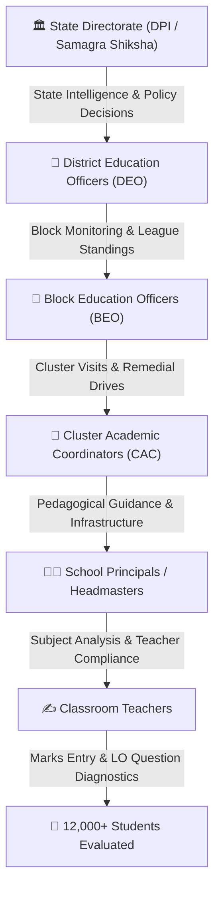

<div align="center">

# 🎓 SHIKSHA DRISHTI (शिक्षा दृष्टि)
### *Next-Generation State Education Intelligence & Academic Governance Platform*

[](https://github.com/aman-choudhary1/Shiksha-Drishti)
[](https://react.dev/)
[](https://nodejs.org/)
[](https://www.postgresql.org/)
[](https://mui.com/)
[](#)

<p align="center">
  <b>A unified, data-driven academic governance and student evaluation platform monitoring 12,000+ evaluated students, 33 districts, 146 educational blocks, and thousands of schools across Chhattisgarh in real-time.</b>
</p>

[✨ Explore Features](#-core-features--capabilities) •
[🏛️ System Architecture](#-system-architecture) •
[📊 State Command Center](#-state-administrator-command-center) •
[🚀 Quick Start](#-quick-start--local-development) •
[📡 API Reference](#-api-architecture--endpoints)

---

</div>

## 📌 Executive Overview

**Shiksha Drishti** (शिक्षा दृष्टि) bridges the gap between state-level educational policymakers and grassroots classroom learning. Built to modernize diagnostic evaluations, it transforms raw examination data into actionable pedagogical interventions, learning outcome (LO) error diagnostics, district league rankings, and institutional report dossiers.



---

## 🌟 Core Features & Capabilities

### 🏛️ 1. State Administrator Command Center (Macro & Micro)
- **Executive State Dossier**: High-level KPIs covering Total Evaluated Students, State Average Score, Pass Rate %, High Achiever Ratio, and Remedial Priority Counts.
- **State-Wide Student Performance Engine**:
  - **Performance Analytics**: Interactive grade distributions (`A+`, `A`, `B`, `C`, `Remedial`), class-wise progression, subject benchmarks, and gender equity analysis.
  - **District & Block Breakdown**: Dynamic league tables ranking all 33 districts and 146 blocks with participation percentages.
  - **Student Roster Explorer**: Searchable, paginated student master table with progress indicators and performance band badges.
  - **Honor Roll & Remedial Cohorts**: State top rankers juxtaposed with immediate remedial intervention cohorts (<40% score).
- **Multi-District Radar Benchmarking**: Head-to-head multi-metric comparative analysis on 6-axis radar charts.
- **Question-Level LO Diagnostics**: Identifies micro-level learning outcomes with high failure rates to deploy targeted teacher training workshops.
- **Teacher Compliance Matrix**: Real-time evaluation submission tracking across state faculty.
- **TV Kiosk Presentation Mode**: Dedicated full-screen, high-contrast dashboard optimized for state control room video walls.

---

### 🏫 2. Multi-Tier Role-Adaptive Portals

| Role | Target Persona | Key Dashboard Capabilities |
|---|---|---|
| `STATE_ADMIN` / `SUPER_ADMIN` | State Education Secretary & Directors | State-wide student intelligence, district league rankings, macro-KPIs, multi-sheet Excel dossier export. |
| `DISTRICT_OFFICER` (`DEO`) | District Education Officers | Inter-block performance rankings, critical school alerts, subject-wise district diagnostics. |
| `BLOCK_OFFICER` (`BEO`) | Block Education Officers | Cluster performance monitoring, teacher evaluation submissions, school inspection targets. |
| `CAC` / `CLUSTER_COORDINATOR`| Cluster Academic Coordinators | Cluster school report cards, academic visit logger, and grassroots mentoring records. |
| `SCHOOL_ADMIN` (Principal) | School Principals & Headmasters | Class-wise report cards, teacher compliance tracking, student grade books, remedial action plans. |
| `TEACHER` | Subject Teachers & Evaluators | Rapid question-by-question marks entry, class report card generation, student performance review. |

---

### 📑 3. Enterprise Report Generation & Export Engine
- **District Performance League (`.xlsx`)**: Fully styled Excel workbook with conditional grade formatting and participation metrics.
- **Critical Intervention Schools Master (`.xlsx`)**: Instant list of schools scoring below 40% with UDISE codes and principal contact details.
- **Learning Outcome (LO) Diagnostic Dossier (`.xlsx`)**: Question-by-question error frequencies for state curriculum revision.
- **Standalone Offline Executive Dossier (`.html`)**: Self-contained, printable executive brief with embedded charts and state directives.

---

## 🏛️ System Architecture

```
┌─────────────────────────────────────────────────────────────────────────────┐
│                           PRESENTATION LAYER (SPA)                          │
│     React 19  │  Material-UI v9  │  Framer Motion  │  Recharts  │  Vite 8   │
└──────────────────────────────────────┬──────────────────────────────────────┘
                                       │ HTTP / REST / JSON
                                       ▼
┌─────────────────────────────────────────────────────────────────────────────┐
│                             API GATEWAY LAYER                               │
│     Express.js  │  Helmet  │  CORS  │  Rate Limiting  │  Audit Logging      │
└──────────────────────────────────────┬──────────────────────────────────────┘
                                       │
            ┌──────────────────────────┴──────────────────────────┐
            ▼                                                     ▼
┌───────────────────────────────┐             ┌───────────────────────────────┐
│     AUTHENTICATION & RBAC     │             │    ANALYTICS & QUERY ENGINE   │
│   JWT Token Verification      │             │   Batched Aggregations        │
│   Redis / Memory Session Mgr  │             │   Pipelined CTE Subqueries    │
└───────────────┬───────────────┘             └───────────────┬───────────────┘
                │                                             │
                └──────────────────────┬──────────────────────┘
                                       ▼
┌─────────────────────────────────────────────────────────────────────────────┐
│                              DATABASE LAYER                                 │
│          PostgreSQL 14+ Connection Pool (Max 25, 20s Connection Guards)     │
│   ├── sd_schools             ├── sd_classes             ├── sd_students     │
│   ├── sd_users & rbac        ├── sd_subjects            ├── sd_assessments  │
│   └── sd_subject_marks       └── sd_audit_logs          └── sd_visits       │
└─────────────────────────────────────────────────────────────────────────────┘
```

---

## 📁 Repository Structure

```
shiksha-drishti/
├── README.md                          # Global repository guide
├── .gitignore                         # Repository-wide ignore rules
│
├── 📂 shiksha_drishti_backend/        # Node.js / Express REST API
│   ├── migrations/                    # Database schema & seed scripts
│   ├── src/
│   │   ├── config/                    # PostgreSQL & Redis pool configurations
│   │   ├── controllers/               # State, District, Block, School controllers
│   │   ├── middleware/                # JWT auth, RBAC authorization, error handler
│   │   ├── routes/                    # API route endpoints
│   │   └── utils/                     # JWT tokens, password hashing, async wrappers
│   ├── server.js                      # Application bootstrap
│   ├── package.json
│   └── README.md                      # Backend specific documentation
│
└── 📂 shiksha_drishti_frontend/       # React 19 / Vite Single Page Application
    ├── public/                        # Static icons and assets
    ├── src/
    │   ├── assets/                    # State emblem, SVG illustrations
    │   ├── components/
    │   │   ├── auth/                  # Authentication & login interfaces
    │   │   ├── common/                # AppLayout, Navbar, Sidebar, Kiosk Header
    │   │   ├── dashboard/             # Role dashboards (State, District, Principal, etc.)
    │   │   ├── marks/                 # Mark entry, question analysis, report cards
    │   │   └── school/                # School profile and infrastructure views
    │   ├── context/                   # AuthContext & global state
    │   ├── services/                  # Axios API communication layer
    │   ├── theme/                     # Customized Material-UI theme
    │   └── utils/                     # ExcelJS exports and date utilities
    ├── index.html
    ├── package.json
    └── README.md                      # Frontend specific documentation
```

---

## 🚀 Quick Start & Local Development

### 📋 Prerequisites
- **Node.js**: v18.0.0 or higher
- **PostgreSQL**: v14.0 or higher
- **Redis**: Optional (integrated in-memory fallback for local dev)

---

### 1️⃣ Clone the Repository
```bash
git clone https://github.com/aman-choudhary1/Shiksha-Drishti.git
cd Shiksha-Drishti
```

---

### 2️⃣ Backend Setup
```bash
cd shiksha_drishti_backend

# Install dependencies
npm install

# Setup environment variables
cp .env.example .env

# Run database migrations
npm run migrate

# (Optional) Seed initial data
npm run seed

# Start development API server
npm run dev
```
> 🌐 Backend API will be available at: **`http://localhost:4000`**

---

### 3️⃣ Frontend Setup
```bash
cd ../shiksha_drishti_frontend

# Install dependencies
npm install

# Setup environment variables
cp .env.example .env

# Start Vite development server
npm run dev
```
> 💻 Web Dashboard will launch at: **`http://localhost:5173`**

---

## 📡 API Architecture & Endpoints

| Category | Method | Endpoint | Description |
|---|---|---|---|
| **Auth** | `POST` | `/api/auth/login` | Authenticate user & issue signed JWT |
| | `GET` | `/api/auth/me` | Fetch active user profile & school scope |
| **State Admin** | `GET` | `/api/state/overview` | Executive state KPIs, grades, critical schools |
| | `GET` | `/api/state/districts`| District performance rankings & league table |
| | `GET` | `/api/state/students` | State-wide student intelligence & honor roll |
| | `GET` | `/api/state/questions`| Question LO error diagnostics |
| | `GET` | `/api/state/teachers` | Faculty evaluation compliance matrix |
| **District** | `GET` | `/api/district/overview`| DEO analytics & block benchmarking |
| **Block** | `GET` | `/api/block/overview` | BEO analytics & cluster indicators |
| **Cluster** | `GET` | `/api/cluster/overview`| CAC monitoring & school visits |
| **Principal** | `GET` | `/api/principal/overview`| School performance, class cards, teacher stats |
| **Assessments** | `GET` | `/api/assessments` | Filter assessments by class, subject, period |
| | `POST`| `/api/assessments/:id/subject-marks/bulk` | Bulk marks submission |

---

## 🛡️ Security & Performance Highlights

- 🔒 **Single-Session Enforcement**: Real-time session token tracking prevents duplicate logins while maintaining session resilience across server reloads.
- ⚡ **Pipelined Connection Pool**: Configured with a `25-connection` maximum pool and `20,000ms` connection timeout guards, handling concurrent state-wide queries in sub-2-second response times.
- 🛡️ **SQL Injection Protection**: 100% parameterized queries across all dynamic analytical filter builders.
- 📦 **Optimized Client Bundle**: Code-split Vite production bundle with tree-shaken Material UI and Recharts.

---

## 👥 Authors & Acknowledgments

- **Lead Developer**: [Aman Choudhary](https://github.com/aman-choudhary1) (`aman.choudhary7722@gmail.com`)
- **Initiative**: Department of School Education, Samagra Shiksha, Government of Chhattisgarh.

---

<div align="center">
  <sub>Built with ❤️ for Chhattisgarh School Education Intelligence • © 2026 Shiksha Drishti</sub>
</div>
